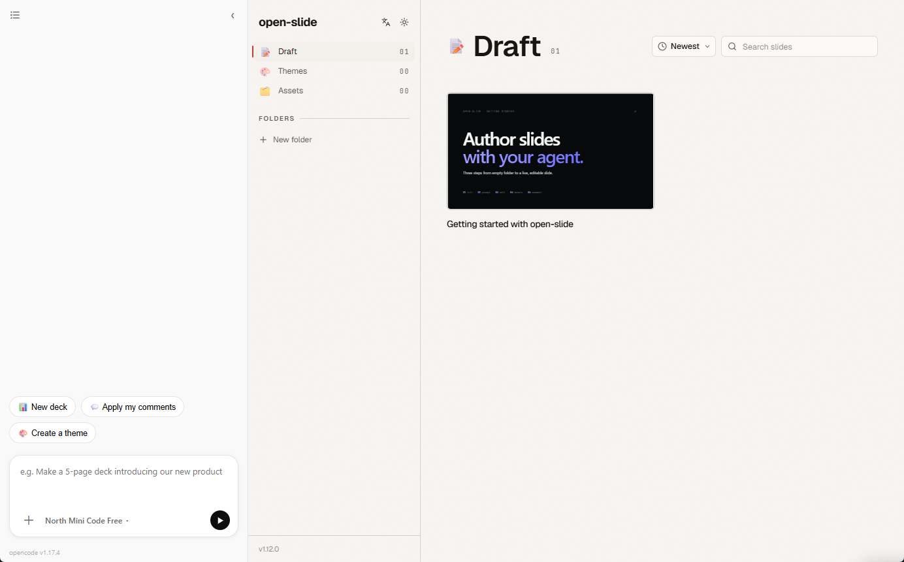

# open-slide studio

<p align="center">
  <a href="README.md">English</a> · <b>繁體中文</b>
</p>

<p align="center">
  <a href="https://github.com/BingHanLin/open-slide-studio/releases"></a>
  <a href="LICENSE"></a>
  
</p>

<p align="center">
  
</p>

**用自然語言對話就能做出投影片。** open-slide studio 是一款桌面應用程式，把
**[opencode](https://opencode.ai) 與 [open-slide](https://github.com/1weiho/open-slide)**
整合進同一個視窗，讓**非工程師**不必碰程式碼，就能從一個想法做出即時、可編輯的投影片。

## 功能特色

- 🗣️ **對話即創作** — 描述你的投影片，代理會幫你撰寫與編輯。
- ⚡ **即時預覽** — 代理一邊編輯，右側投影片一邊熱重載。
- 🎨 **主題、素材與註解** — 可請它套主題、管理素材、套用你的行內註解。
- 🔌 **自帶模型** — 在 App 內連接任何 opencode 支援的供應商。
- 💬 **對話紀錄** — 每份投影片各自保留聊天歷史。
- 📦 **自帶完整環境** — 單一 Windows 安裝檔，不需安裝 Node.js 或 npm。
- 🔄 **自動更新** — 新版本背景下載，關閉 App 時自動安裝。
- 🔒 **預設安全** — 代理被限制在投影片專案內（不能執行任意 shell）。

---

# 給使用者

## 安裝

**Windows。** 從 [Releases](https://github.com/BingHanLin/open-slide-studio/releases)
頁面下載 **`open-slide-studio-Setup-<版本>.exe`** 後執行。

安裝檔是**自帶完整環境的**——內含 opencode 與一個可直接執行的 open-slide 專案，所以你
**不需要安裝 Node.js、npm 或任何其他東西**。首次啟動會花約一分鐘準備你的投影片工作區
（一次性複製）。

> 目前尚未經過程式碼簽章，Windows SmartScreen 首次執行時可能跳出警告——請選擇
> **更多資訊 → 仍要執行**。

## 開始使用

1. **連接模型。** 打開 **連接（connect）** 面板並加入供應商——貼上 API key，或使用其登入
   流程。你需要有某個模型供應商的使用權限（使用量可能會計費）。App 會把自己的憑證與紀錄
   獨立保存，與機器上其他 opencode 互不干擾。
2. **描述你想要的內容。** 例如：
   - *「做一份 5 頁、介紹我們新產品的投影片。」*
   - *「幫它套一個深色主題。」*
   - *「套用我的註解。」*
3. **看著它生成。** 代理編輯投影片，右側的 deck 會即時更新。

## 更新

安裝版會在啟動時檢查 [Releases](https://github.com/BingHanLin/open-slide-studio/releases)，
背景下載較新的版本，並在你**下次關閉 App 時**自動安裝。

---

# 運作原理

open-slide studio 把兩個開源專案併進同一個視窗：

- **[opencode](https://opencode.ai)** — AI 程式代理 — 以無介面（headless）方式執行，作為
  撰寫、編輯投影片檔案的引擎。
- **[open-slide](https://github.com/1weiho/open-slide)** — 建構在 Vite 上的 React/MDX
  投影片框架 — 負責渲染並即時熱重載投影片。

```
┌─────────────────────────┬─────────────────────────┐
│  opencode 代理對話       │  open-slide 即時投影片   │
│  (左側 — 在這裡輸入)     │  (右側 — 即時更新)       │
└─────────────────────────┴─────────────────────────┘
```

代理編輯 React/MDX 投影片檔案；open-slide 的 Vite 開發伺服器熱重載；你即時看到投影片變化。
代理與檢視器之間不需要任何橋接程式碼 —— **檔案系統 ＋ 熱重載本身就是橋樑。**

```
Electron 外殼
├── main.js  ── 啟動 open-slide 開發伺服器（子行程）
│            └─ 啟動 `opencode serve`（cwd = 投影片資料夾）並連上 client
├── preload  ── 鎖定權限的 IPC 橋接（只有對話，無 fs/node）
└── renderer ── 左：對話 UI   右：<webview> → open-slide 開發伺服器
```

**獨立的 opencode 環境。** App 啟動 `opencode serve` 時，會把它的設定與資料目錄指向 App 自己
的使用者專屬路徑——`<userData>/opencode-data`，透過 opencode 認得的 `XDG_*` base-dir 環境變數
設定——而**不是**機器上全域的 opencode 設定（例如 `~/.config/opencode`）。因此 App 的憑證
（`auth.json`）、對話紀錄（`opencode.db`）與模型快取都存放在 App 底下、彼此獨立：在終端機登入
opencode 與在 App 內認證是兩回事，雙方互不可見、互不影響。

---

# 給開發者

## 從原始碼開發

前置需求：**Node.js** 18+。

```bash
git clone https://github.com/BingHanLin/open-slide-studio.git
cd open-slide-studio
npm install             # 同時下載版本鎖定的 opencode 二進位檔
npm run init-slides     # 將 open-slide 專案 scaffold 到 ./slides
npm start
```

開發模式下投影片伺服器透過 npm script 啟動；打包後則改用 Electron 內建的 Node 執行——這也是
安裝版不需要 Node 的原因。

## 設定

這些設定位於 App 套件內的 `config.json`，因此**只在從原始碼執行或建置時**才有意義——安裝版
使用者一切都在 App 內設定。

- `slideProjectDir` — open-slide 專案位置（預設 `slides`；安裝版解析到可寫的資料夾、開發時
  解析到專案根目錄）
- `slideDevCommand` / `slideDevArgs` — 開發模式如何啟動投影片伺服器（`npm run dev`）
- `opencode.bin` — opencode 執行檔；預設為 npm 安裝的二進位檔。相對路徑相對於 App 根目錄解析，
  純名稱則走 PATH。
- `opencode.model` — `provider/modelID`，例如 `kimi-for-coding/k2p6`
- `opencode.permission` — 代理的權限鎖定（編輯限制在投影片專案內、停用 shell），對非工程師
  才安全
- `opencode.port` — 伺服器埠（預設 `4099`；投影片開發伺服器的埠是動態的，會從 Vite 輸出自動
  偵測）

## 建置安裝檔

```bash
npm run dist            # → dist/open-slide-studio-Setup-<版本>.exe  （NSIS，Windows）
npm run pack            # → dist/win-unpacked/  （未封裝的 App，無安裝檔，較快）
```

必須先 scaffold 一個 `slides/` 專案（`npm run init-slides`）；建置時的 `afterPack` hook 會把
它——連同 `node_modules`（Vite、open-slide CLI、esbuild/rollup 原生二進位檔）——打包成首次啟動
要 seed 的樣板。opencode 二進位檔會做 asar-unpack，才能在執行時被啟動。

---

## 致謝

本專案建構於、並感謝 **[opencode](https://opencode.ai)** 與
**[open-slide](https://github.com/1weiho/open-slide)**。

## 授權

[MIT](LICENSE) © 2026 Binghan Lin
